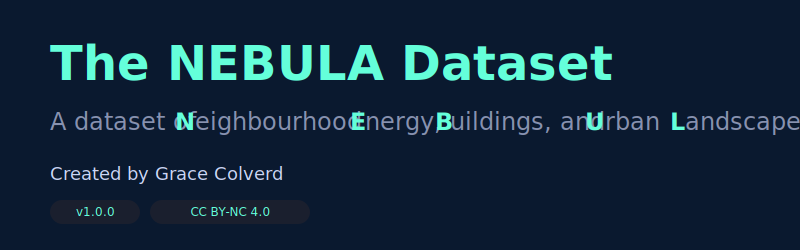
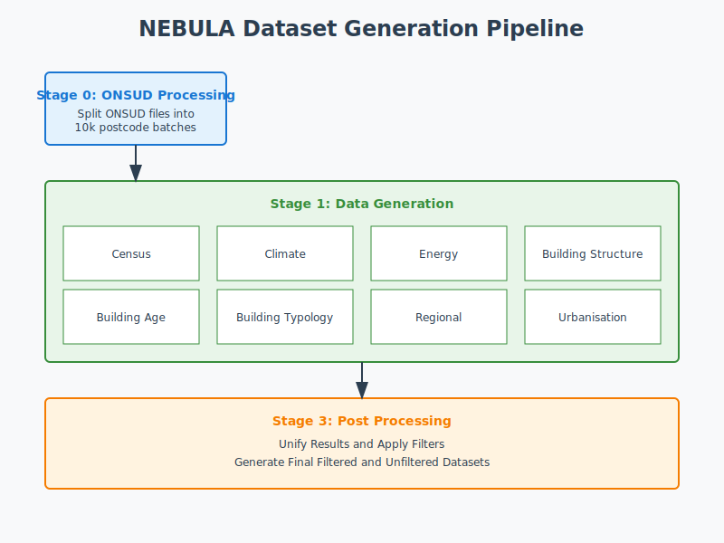

# NEBULA Dataset Generation

This repository contains scripts for generating the NEBULA dataset, a postcode-level dataset for neighbourhood energy modelling. 

- A conference paper introducing this dataset - [NeurIPS 2024 Climate Change AI](https://s3.us-east-1.amazonaws.com/climate-change-ai/papers/neurips2024/23/paper.pdf) 
- Work that uses this dataset [BuildSys 2024 Benchmarking paper](https://dl.acm.org/doi/proceedings/10.1145/3671127?tocHeading=heading1)
- Data Descriptor Paper [Pre-Print](https://arxiv.org/abs/2501.09407). 





## Prerequisites

### Environment Setup
```bash
# Create new environment
conda create -n nebula python=3.10

# Activate environment
conda activate nebula

# Install requirements
pip install -r requirements.txt
conda install conda-forge::libgdal==3.6.4
#  libtiff==4.5.0
```

### Required Data Sources

#### User-Provided Data (Non-Open License)
- Building Stock Data (Verisk)
- Postcode Shapefiles (Edina)

Conversations with OS indicated postcodes shapefiles are open access data but we reccomend user download them themselves from accredited sources. 

#### Provided Data (Open Government License)
Place these files in the `input_data_sources` directory, or download from our Zip:

1. Gas and Electricity Data (DESNZ, 2022)
2. ONS UPRN to Postcode Mapping (2022)
3. Building Floor Count Global Averages
4. Census 2021 Statistics
5. Census 2021 Postcode-Output Area-Region Mappings
6. Output Areas 2011-2021 Mapping
7. Postcode Areas: area of postcodes (derived from postcode shapefiles)
8. Climate Data (HAD-UK Monthly Temperature, 2022)

## Directory Structure

```
input_data_sources/                   # Input data files
├── census_2021/
├── climate_data/
├── energy_data/
├── lookups/
│   ├── oa_lsoa_2021/               # OA to LSOA mapping
│   └── oa_2011_2021/               # OA conversion lookup
├── ONS_UPRN_DATABASE/
├── postcode_areas/
└── urban_rural_2011/

batches/                         # Processing batch lists

src/                              # Source code


intermediate_data/                # Temporary processing files - sub-themes results stored here
├── age/
├── census_attrs/
├── fuel/ 
├── temp_data/         
└── type/

final_dataset/                   # Output files
├── NEBULA_data_filtered.csv
├── Unfiltered_processed_data.csv
└── attribute_logs/             # Logs for building stock batch calculations - shows counts of records in each batch 
    ├── age_log_file.csv
    ├── fuel_log_file.csv
│   └── fuel_log_file.csv


main.py                     # Process for generating whole dataset if running locally 

split_onsud.py               # If running on HPC - stage 1 generates batch files 
generate_building_stock.py   # HPC python wrapper 
nebula_job.sh                # If running on HPC - bash script to submit multiple batches 
submit_nebula.sh            # If running on HPC - slurm submit for single batch 

create_global_averages.py  #Script for generating the global averages table. We include the 2022 global averages in intermediate data. Script provded for reference.  
```

## License
© 2024 Grace Colverd

This code is licensed under a Creative Commons Attribution-NonCommercial-ShareAlike 4.0 International License. To view a copy of this license, visit http://creativecommons.org/licenses/by-nc-sa/4.0/

For commercial use, please contact: gb669@cam.ac.uk.

The processed dataset is available under an open licence - please see the accompanying paper for details. 

## Usage

1. Install dependencies from requirements.txt
2. Place input data in appropriate directories
#### If running locally 
3. Configure variables in main.py as needed
4. Run the processing pipeline:
   ```bash
   python main.py
   ```
#### If running on HPC 
3. Generate the batches of 10k
   ```bash
   split_onsud.py
   ```
4. Update slurm scripts nebula_job.sh and submit_nebula.sh to run fuel, age and typology calculation 
5. Submit multiple jobs using nebula_job.sh 
6. When all themes finished calculating, update main.py to just call the post process section 


## Output Dataset

The pipeline generates postcode-level statistics including:
- Building age and type distributions
- Temperature data (HDD/CDD)
- Census demographics
- Building statistics and averages

## Notes
- We batch up the process of converting the building stock dataset into postcode attributes (themes: building stock, typology and age). This enables better logging and multi threading. Current set up is to process each region separately and split into batches of 10k postcodes. 
- We provide two generation routes: local and HPC generation. For one region: running locally takes an estimated 48 hours. Multi threading can speed this up.
- When running on HPC, we submit each type / region / batch as a separate job. Using a 8GB (3 CPUS) job, each 10k batch takes approx. 1.5 hours for fuel and 20 minutes for age/type. Total run time: (152 * 1.5) + (2 * 152 * .3)  = 319 hours. 
- Check overlapping_pcs.txt for postcode boundary issues
- See global_avs/ for reference statistics
- Intermediate files can be safely deleted after final dataset generation

<!-- # NEBULA Dataset Generation

This repository contains scripts for generating the NEBULA dataset, a postcode-level dataset for neighbourhood energy modelling. 

## Prerequisites

# Install requirements
```
# Create new environment
conda create -n nebula python=3.10

# Activate environment
conda activate nebula

# Install requirements
pip install -r requirements.txt
conda install libgdal==3.6.4
conda install libtiff==4.5.0

```

### Required Data
#### User provided (not open licence)
1. Building Stock Data (Verisk)
3. Postcode Shapefiles (Edina)

#### Provided in Drive - download zip file and place in input_data_sources.
#####  Governmental data  were downloaded in April 2024 under the Open Government Licence.If you want more up to date, these can be replaced. 

1. Gas and Electricity data (DESNZ) (2022)
2. ONS ONSUD UPRN to Postcode Mapping (2022)
3. Global Averages for building floor count (derivation script is provided)
4. Census 2021 Statistics files (downloaded in April 2024)
5. Mapping from Postcodes to Output areas and regions (Census 2021)
6. Mapping from output areas 2011 to Output Areas 2021 (used for Rural/Urban 2011 classification)
7. Postcode areas: these were derived from ONS postcode shapefiles using the script generate_pc_area.py. You can replace with own. 
8. Climate data: Monthly temperature data from HAD-UK, Downloaded from CEDA, (2022)


## Directory Structure

```
input_data_sources/
    ├── census_2021
    ├── climate_data
    ├── energy_data
    ├── lookups
        ├──OA to LSOA mapping census 2021
        ├── OA 2011 to OA 2021 lookup
    ├── ONS_UPRN_DATABASE
    ├── postcode_areas
    └── urban_rural_2011

batches/  # Stores batch lists used in processing pipeline, more info in src/split_onsud_file
    ...
src/
    ├── global_avs/
       ├── Global average tables
    ├── age_perc_calc.py   # Age percentage calculations
    ├── age_perc_proc.py   # Age percentage processing
    ├── fuel_calc.py       # Fuel type calculations
    ├── fuel_proc.py       # Fuel type processing
    ├── global_av.py       # Generation of global averages
    ├── multi_thread.py    # Multithreading utilities
    ├── pc_main.py        # Framework for postcode level processing
    ├── post_process.py   # Post-processing utilities
    ├── postcode_utils.py # Utils functions
    ├── pre_process_buildings.py # Building data preprocessing
    ├── split_onsud_file.py     # ONSUD file splitting
    ├── type_calc.py      # Building type calculations
    └── type_proc.py      # Building type processing

intermediate_data/
    ... directory where intermediate files will be stored. Can be deleted after final dataset is generated

final_dataset/
    ... Folder for final dataset to be stored
        'NEBULA_data_filtered.csv' : the final nebula dataset, which is filtered / cleaned 
        'Unfiltered_processed_data.csv' : the whole postcode sample including mixed postcodes
    ├── attribute_logs
        .. logs for the fuel, age and typology building stock generation process, logs show the counts for each batch that are processed.

main.py # Dataset generation script 

```

## Usage

1. Set up your environment and install dependencies (requirements.txt recommended)
2. Place input data in appropriate directories
3. update any variables as needed in main.py
4. Execute the main processing pipeline:
```bash
python main.py
```
5. If any problems, you can re-run subsections of the pipeline from within main.py

## Output

The pipeline generates postcode-level statistics including:
- Building age distributions
- Building type distributions
- Local temperature data (HDD and CDD)
- Socio-demographics from uk census
- Global averages and statistics

## Notes

- Check `overlapping_pcs.txt` for any postcode overlap issues
- The `global_avs/` directory contains reference averages

  -->
